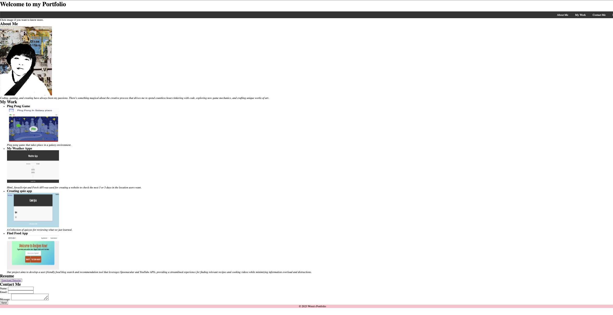

# MyProfessional-Portfolio
Welcome to My Portfolio! My name is Thi Tu Nhu Nguyen, but you can call me "Wren." Thank you for taking the time to visit my website.

## About Me
I have a diverse range of experience and education, starting with over three years of working as a pharmacy technician at CVS Pharmacy. During this time, I developed strong organizational and communication skills, as well as a keen attention to detail.

In addition to my work in the pharmacy industry, I also have a background in research science. I worked at the Vietnam Academy of Science and Technology, where I learned valuable skills such as data analysis and research methodology.

To further expand my skill set, I pursued additional education in information technology. I completed a full-stack developer boot camp at Rice University and also took the highly-regarded CS50 course offered by Harvard University. Through these programs, I gained proficiency in programming languages such as Java, Python, and JavaScript, as well as in front-end and back-end web development.

I hold an associate of science degree from Lonestar College with a GPA of 3.7. Additionally, I was recognized for my achievements with graduation honors in pharmacy technician from Ashworth College, where I also earned certification in the field.

## Contact Information
Website: https://nhunguyen-debug.github.io/MyProfessional-Portfolio/ 
Email: thitunguyen@my.lonestar.edu 
## Final Words
Thank you for taking the time to visit my portfolio and learn more about me. I am a highly skilled and passionate professional who is ready to take on new challenges and achieve great things. Please feel free to reach out to me through the contact information provided above for any opportunities or inquiries.

## Thank you again for your interest!

© 2023 edX Boot Camps LLC. Confidential and Proprietary. All Rights Reserved.